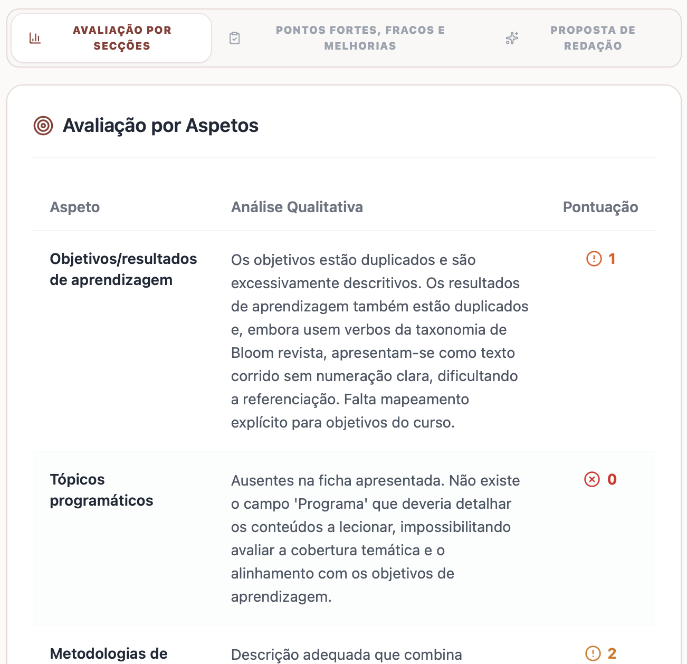
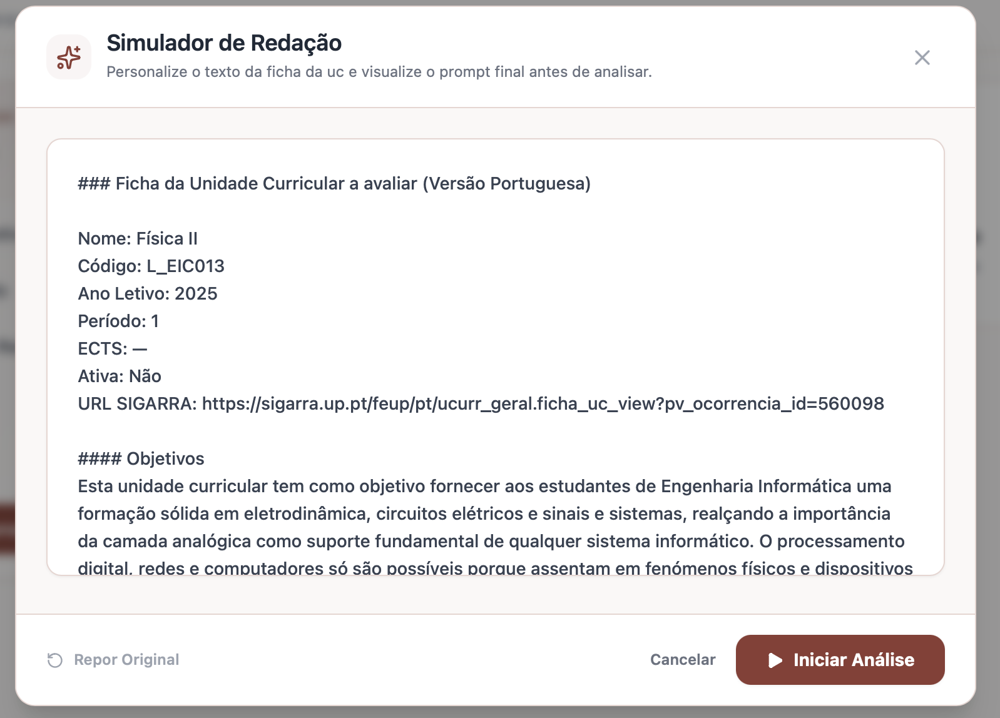
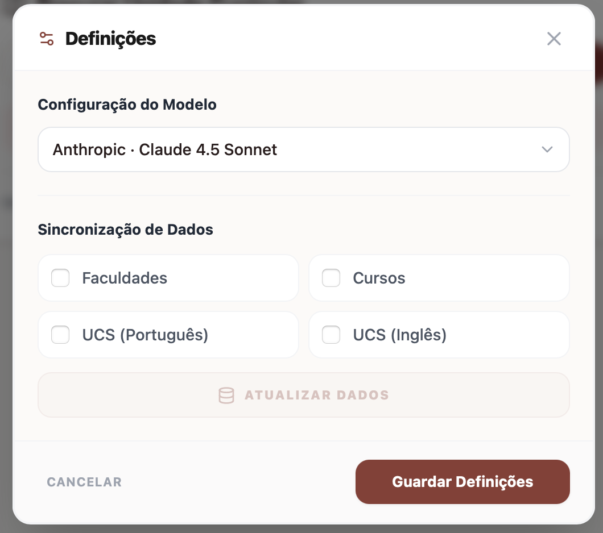

# 🫧 UCReview — AI-Powered Academic Validation

  
  
  
  

> A full-stack research project built during my **Research Grant (BII) @ FEUP**. An automated pipeline designed to scrape, parse, and semantically audit university Course Information Sheets (Fichas de UC) using a multi-provider AI factory.

---

## 📍 Table of Contents
* [📖 The Problem](#-the-problem)
* [📸 Product Showcase](#-product-showcase)
* [🧩 Engineering Challenges](#-engineering-challenges)
* [🛠️ Stack & Infrastructure](#-stack--infrastructure)
* [💡 Technical Takeaways](#-technical-takeaways)
* [🗝️ Code Availability](#-code-availability)

---

## 📖 The Problem
FEUP processes hundreds of Course Information Sheets annually. Historically, ensuring these pages followed strict ECTS and pedagogical guidelines was nearly impossible to scale, leading to inconsistent or incomplete information for students.

**UCReview** acts as a **Digital Guideline**. Instead of just flagging errors, it provides professors with actionable, AI-driven feedback. It bridges the gap between raw data and institutional standards, helping staff refine their pages to be as informative and pedagogically sound as possible.

---

## 📸 Product Showcase

### 1. Management Dashboard (`dashboard.jpg`)
The entry point for Course Directors. A clean, search-oriented interface to quickly locate specific Curricular Units or manage assigned UCs from a centralized list.

### 2. UC Management Hub (`uc-page.jpg`)
Centralizes core metadata (ECTS, Year, Period). From here, directors can perform an immediate **"Análise Sigarra"** or enter **"Simular Texto"** mode to customize the syllabus before auditing.

### 3. Automated Analysis & Feedback (`analysis.png`)
The system generates a detailed audit broken down by parameters (Objectives, Programmatic Topics, Methods). It provides qualitative analysis and a numerical score, flagging specific issues like duplicated objectives.

<b>🛠️ View Advanced Features (Writing Simulator & Admin)</b>

 

<strong>Writing Simulator (`writting-simulator.png`)</strong> 
 
<em>A sandbox where professors can stage edits and receive real-time AI feedback.</em>

 

<strong>Admin Settings (`admin-settings.png`)</strong> 
 
<em>Control panel for LLM selection and manual data synchronization.</em>

---

## 🧩 Engineering Challenges

### 1. Data Ingestion Engine
* **Problem:** SIGARRA provides no API and data is inconsistent (nested HTML tables, irregular Markdown).
* **Solution:** Developed a **Scrapy spider** with a **PostgreSQL pipeline**. I implemented **atomic upserts** to ensure repeated runs update existing data without duplicates, enabling reliable synchronization of thousands of course records.

### 2. Multi-Provider LLM Factory
* **Problem:** Relying on a single AI provider creates vendor lock-in and inconsistent output formats.
* **Solution:** Built a **Python Factory Pattern** to switch seamlessly between **OpenAI, Anthropic, and DeepSeek**. I integrated strict **JSON validation schemas** to ensure predictable AI outputs for database persistence.

### 3. Production-Grade Orchestration
* **Problem:** AI audits take 30 to 60 seconds, which would timeout standard web requests.
* **Solution:** Designed an **asynchronous pipeline** with **Celery + Redis**, offloading heavy tasks to background workers. I tuned **Nginx** with 300s timeouts to ensure stable performance during long-running semantic analysis.

### 4. Institutional Security (OIDC)
* **Problem:** Faculty data is sensitive and requires secure, authenticated access.
* **Solution:** Integrated **OpenID Connect (OIDC)** with FEUP’s identity provider, enabling secure authentication for staff using their institutional credentials.

---

## 🛠️ Stack & Infrastructure

`Django` · `React` · `TypeScript` · `Tailwind CSS` · `Celery` · `Redis` · `PostgreSQL` · `Scrapy` · `OpenAI` · `Anthropic` · `DeepSeek` · `Nginx` · `Docker` · `OIDC`

---

## 💡 Technical Takeaways

This was my first project moving from local scripts to a **production-grade system**.

* **Systems over Scripts:** I learned that building a real application is 20% features and 80% "plumbing." Refactoring the ingestion pipeline taught me to prioritize data integrity over the easiest coding path.
* **Architecture as Insurance:** The **LLM Factory** taught me foresight. Using the Factory Pattern allowed me to swap models in minutes when project requirements shifted, preventing significant technical debt.
* **Owning the Infrastructure:** This was my first time managing a full deployment. Setting up a Linux VM, Nginx, and Docker from scratch taught me that a project isn't "done" until it’s stable and secure in production.
* **The Reality of Data:** SIGARRA taught me that real-world data is chaotic. I learned to build defensive parsers, realizing that AI reliability depends entirely on the quality of the data ingestion.

---

## 🗝️ Code Availability

Built under a formal **Research Grant (BII)** at FEUP. Source code is kept private to respect institutional IP. 

**Happy to walk through architecture, design decisions, and AI prompting strategy in detail.**

---

  &nbsp;
  

